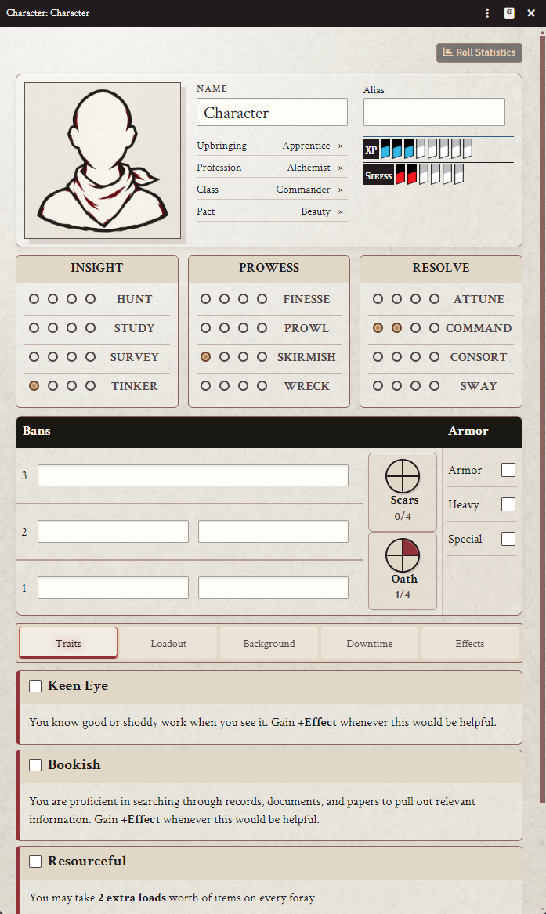
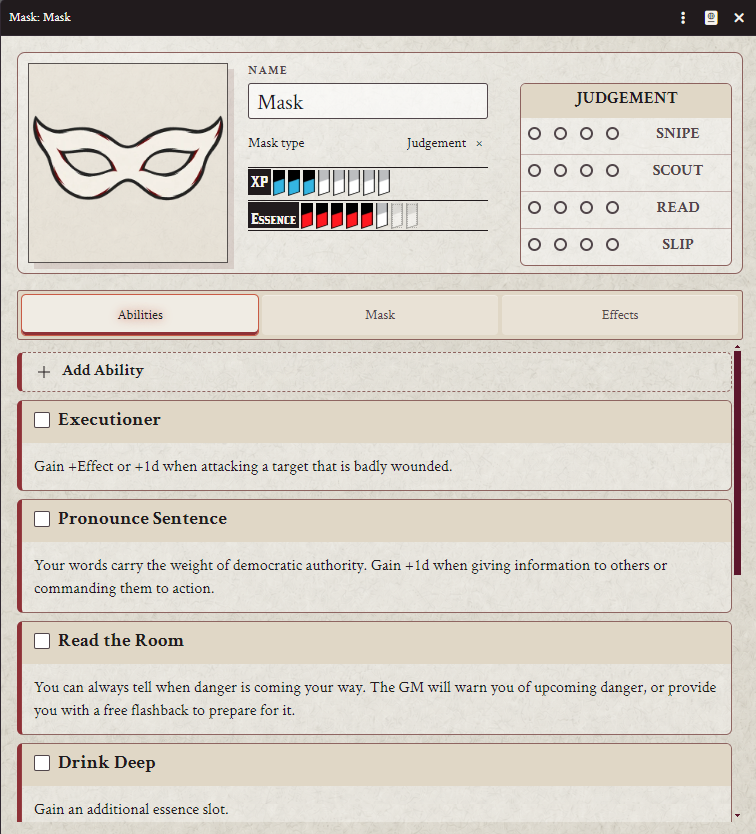
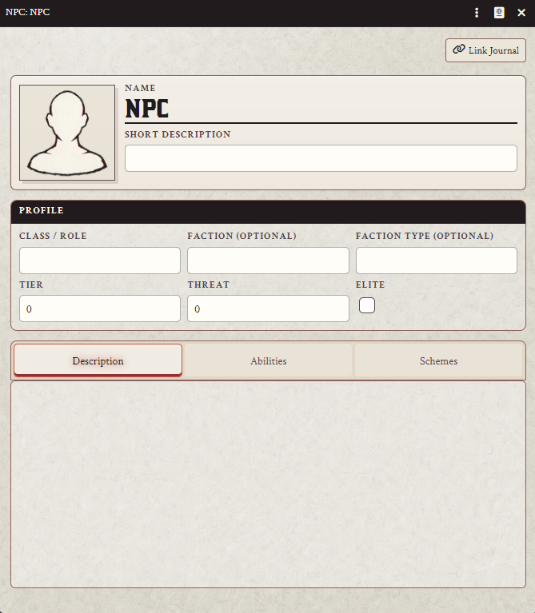
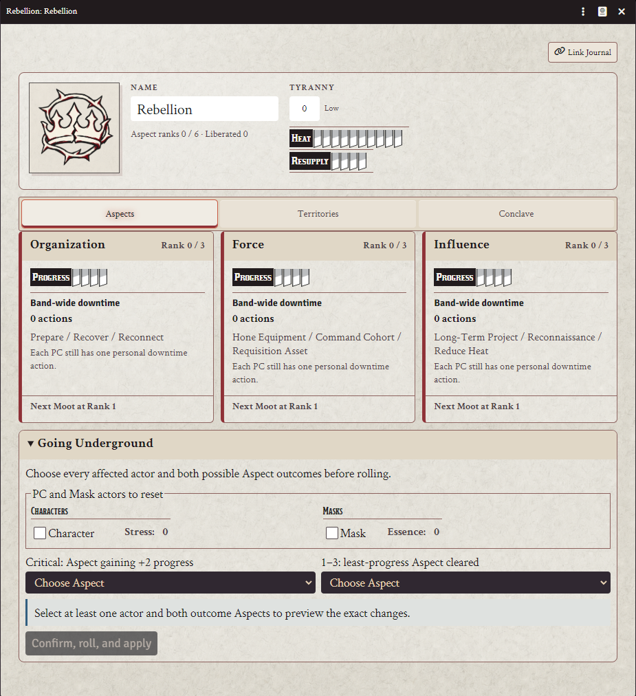
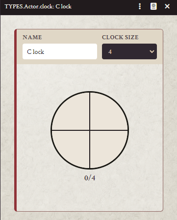
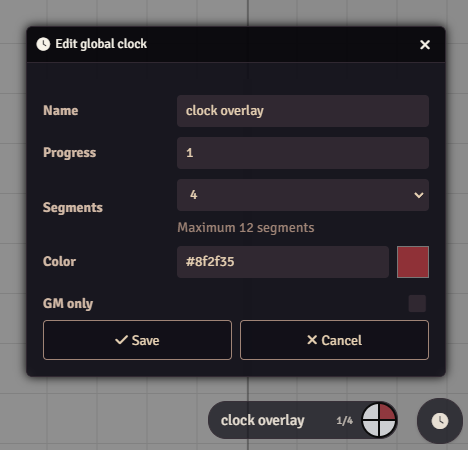

# Brinkwood for Foundry VTT

An unofficial, work-in-progress implementation of [Brinkwood: The Blood of Tyrants](https://brinkwood.net) for Foundry Virtual Tabletop v13.

The current release provides a strong pre-1.0 foundation for new campaigns. Further refinement and breaking changes remain possible because the system has not yet been campaign-tested.

## Screenshots

<table>
  <tr>
    <td align="center"><strong>Character sheet</strong><br></td>
    <td align="center"><strong>Mask sheet</strong><br></td>
  </tr>
  <tr>
    <td align="center"><strong>NPC sheet</strong><br></td>
    <td align="center"><strong>Rebellion sheet</strong><br></td>
  </tr>
</table>

<p align="center">
  <strong>Standalone Clock actor</strong><br>
  
</p>

<p align="center">
  <strong>Global progress-clock overlay</strong><br>
  
</p>

## Installation

Install or update the system with this manifest URL:

```text
https://raw.githubusercontent.com/bedhev-spec/foundryvtt-brinkwood-reforged/main/system.json
```

Maintainers can follow [RELEASING.md](RELEASING.md) for the branch, version, tag, and Foundry publication workflow.

## Features

### Characters and Masks

- Responsive Character and Mask sheets
- Action, resistance, and Mask action rolls
- Upbringing, Profession, Class, Pact, and Mask type selection
- Automatically granted Traits and Action Dot bonuses
- Stress, Essence, Oath, XP, Scars, Bans, Armor, Background, and Downtime tracking
- Categorized loadouts with load values, capacity calculations, and selection controls
- Mask Abilities, additional Essence slots, and cross-Mask Abilities
- Active Effects and Roll Statistics for seeing just how strongly the Tyrants seem to be against you

### NPCs

- Structured profiles covering role, faction, tier, threat, elite status, Abilities, descriptions, and schemes
- Optional Journal links with controls to open, change, or unlink entries

### Rebellion

- Dedicated Rebellion record sheet
- Organization, Force, Influence, Tyranny, Heat, and Resupply
- Aspect ranks, band-wide Downtime, and Moot decisions
- Territories, Sedition, Conclave allies, and Going Underground
- Explicit Character and Mask selection for Going Underground
- GM correction controls for ranks, territory progression, and mistaken Moot answers
- Optional Journal links
- Legacy Lands section for campaign extensions

### Items and Compendiums

- Permission-aware loadout Item editing
- GM-controlled Active Effects
- Compendiums for Classes, Upbringings, Professions, Masks, Pacts, Traits, Items, and Moot decisions

### Foundry Integration

- Foundry v13 ApplicationV2 Actor and Item sheets; v14 may follow later
- Responsive layouts and consistent Brinkwood styling
- Reusable controls and tooltips
- Persistent global progress-clock overlay with GM controls
- English localization

## Compatibility

- Foundry VTT v13
- Verified with Foundry `13.351`
- Foundry VTT v14 has not been verified or tested
- New worlds only; migration from older campaign worlds is not supported

## Project Status

This system remains under semi-active development and has not reached a stable 1.0 release.

Custom-content authoring is not supported for Upbringings, Professions, Classes, Mask types, Pacts, Traits, Moot decisions, or the legacy Crew Reputation and Associates types. Their secondary editors still rely on [quadur's v0.5 work](https://github.com/quadur/foundryvtt-brinkwood) and are not fully compatible with Foundry v13. Use the supplied compendiums; the loadout Item editor is the supported custom-item editor.

## Credits and Licence

- This project is based on [megastruktur's Blades in the Dark system](https://github.com/megastruktur/foundryvtt-blades-in-the-dark) and [quadur's earlier Brinkwood work](https://github.com/quadur/foundryvtt-brinkwood).
- The global clock overlay adapts the clock-only portion of [Carlos Fernandez's Global Progress Clocks](https://github.com/CarlosFdez/global-progress-clocks).
- This is an unofficial Brinkwood system. It is not associated with or endorsed by Far Horizons Co-op or any of Brinkwood's authors.
- The project code is licensed under the GNU General Public License v3.0. The adapted Global Progress Clocks component retains its MIT licence.
